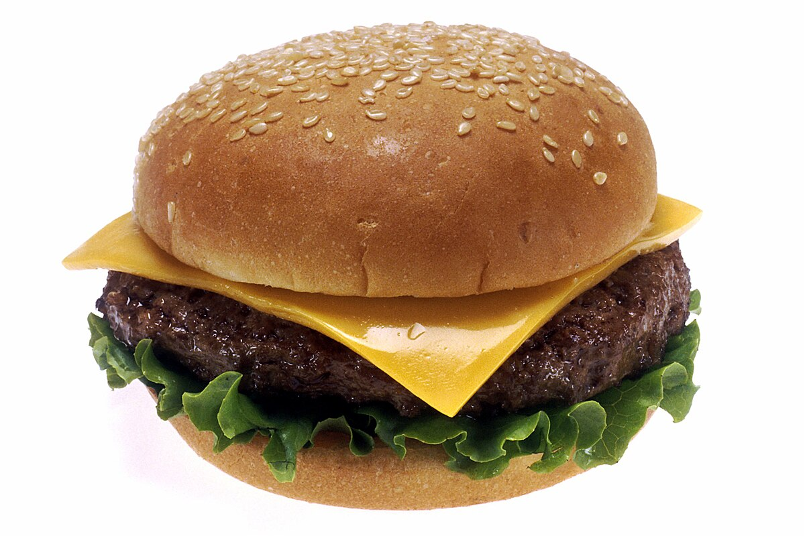

# TEST-1-Jedzenie-i-napoje

# TEAM
1. Kacper Skotarski SkotarskiKacper 236500 3,6
1. Antoni Rachwał arachwal 242765 1,2
1. Michał Leśniak Lesniakakieski 242903 4,5

# WPROWADZENIE

> Jedzenie to podstawowa potrzeba każdego czlowieka, bez jedzenia człowiek zginie bolesną śmiercią głodową, i zamieni sie w popiół. Właściwie to nie tylko człowiek musi jeść ale i zwierzęta też, więc np jeśli krowa zje trawe, i człowiek zje krowe, to czy znaczy to że człowiek zjada trawe?

>Ale nie zastanawiajmy sie nad szczegółami, i zajmijmy sie tym co ważne, czyli nie wszystko dobre co dobrze smakuje.  

>typowy hamburger zawiera w sobie 300 kalorii i jest niezdrowy, dlatego nie wskazane jest sporzywanie ich w ilościach hurtowych. Lepiej jest zjeść coś zdrowszego, na przykład sałatkę ze startego jabłka i marchewek.

# DANE

|posiłek|ilość kalorii|cena(zl)|typ|
|--|--|--|--|
|hamburger|300|8|fast-food|
|sałatka grecka|190|7|przekąska|
|Pizza|970|28|obiad|

# OBRAZY

